# Dune的基础学习

---

## 前置基础
**平台地址**  <https://dune.com/browse/dashboards>

**视频课程**  <https://www.youtube.com/@dunecom>  

**相关文档**
- https://docs.dune.com/learning/how-tos/create-your-first-query
- https://decert.me/tutorial/MasteringChainAnalytics/ch01/ch01-dune-platform-introduction
- https://github.com/duneanalytics/docs-zh-cn

---

## Dune基础介绍
在X上，有个师傅简单的介绍了Dune，下文是引用他的原话:
<https://twitter.com/gm365/status/1525018161686675456>
>区块链本质上是一个去中心化的账本，所有过往的交易转账、合约调用形成了一条条的交易记录明细，包含交易时间、转入、转出地址、交易金额、调用信息、合约事件、tx_hash 等数据。
>
>Dune 将以上所有数据分门别类进行存储形成数据仓库，供有需要的人调用、查询、分析（可谓功德无量）

即时数据可能我测试大概只相差50个区块，确实功德无量

---

## 第一个查询
在 Dune 创建第一个查询，如下图：

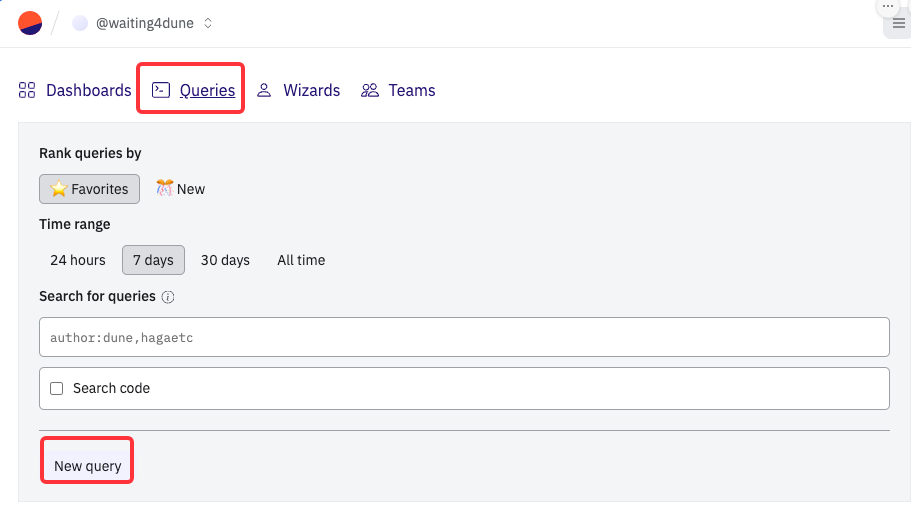

在查询开始之前，我们需要先定下一个远大的目标，现在是2024年3月9日。在3月7日周四的时候，群友在群里吐槽eth的gas高达245刀。

待会我们通过Dune的公开数据库查询将相关的信息查询出来，并尝试找到为什么当天gas会这么高？

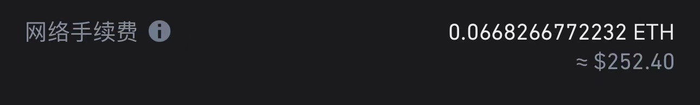

### Dune提供的数据库
参考链接：<https://docs.dune.com/web-app/query-editor/data-explorer>

查询的第一步，我们需要知道我们查询的数据他具体存在在那个表中中，在查询页面，可以看到左侧有一个table栏目。这里记录了Dune提供的数据。  

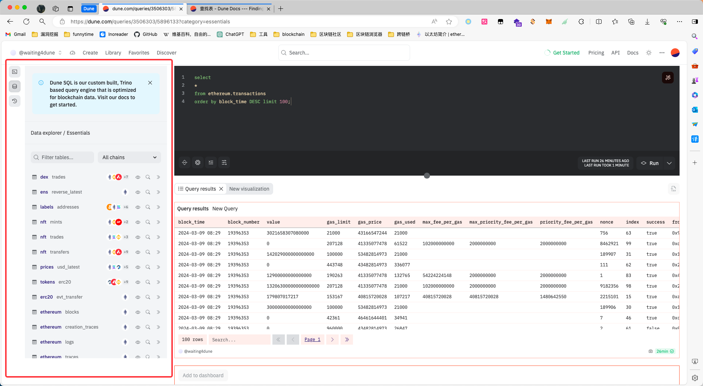

我们可以在这个基础上找到我们想要查询的数据表，我们现在的目标是找到为什么3月7日gas这么高，那么我们就可以通过过滤器来查找eth链的数据。

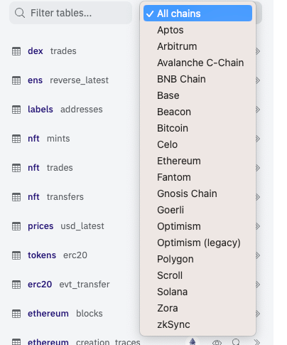  

选择了eth之后我们可以看到下方有如下数据表：  

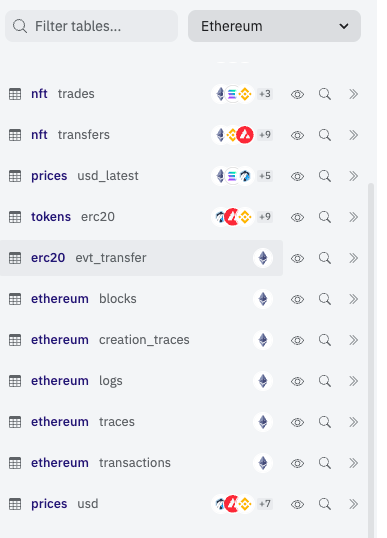

既然是查gas，那么可以从交易表开始查。点击小眼睛我们可以对表进行预览，确认当前表中大致有那些内容。  

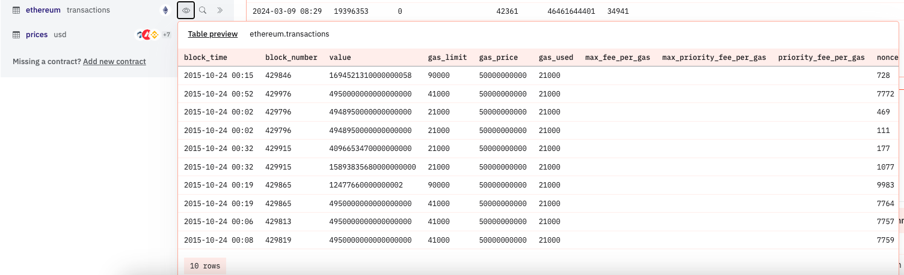

群友交易的时间大概是`2024-03-07 13:42`,那么我们先从这个表中查询13-14点这个时间的所有区块的`gas_price`。那么我们语句应该就是：
```sql
select *
from ethereum.transactions
where block_time BETWEEN '2024-03-07 13:00:00' AND '2024-03-07 14:00:00';
```
但是，因为不清楚具体的数据类型，所以出错了  
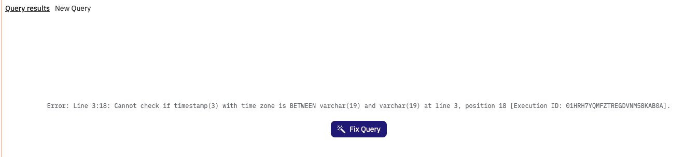
不过Dune的AI提供了修复功能，那么我就可以单机fix按钮，修复语法。最后我们得到了一个基础语法：
```sql
SELECT
  *
FROM ethereum.transactions
WHERE
  block_time BETWEEN CAST('2024-03-07 13:00:00' AS TIMESTAMP) AND CAST('2024-03-07 14:00:00' AS TIMESTAMP)
```
下面是查询出来的效果  
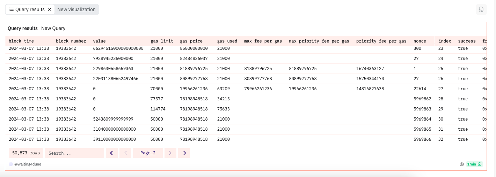

接下来可以通过对`gas_price`进行排序,查看当时这个时间段最高的`gas`是谁出的。
```sql
SELECT
  *
FROM ethereum.transactions
WHERE
  block_time BETWEEN CAST('2024-03-07 13:00:00' AS TIMESTAMP) AND CAST('2024-03-07 14:00:00' AS TIMESTAMP) order by gas_price DESC
```

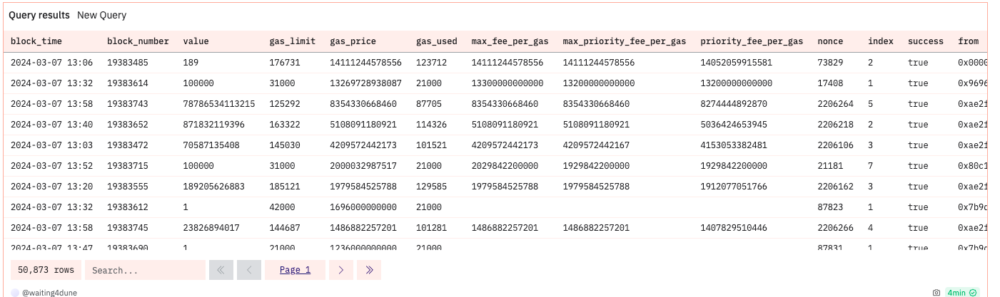
龟龟，`14111244578556 * 123712`，大概就2个e吧。

而自从伦敦升级之后，basefee会随着当前的交易人数逐块递增，那么我们基于这个结果去查询这段时间哪个地址收到的交易最多，在去尝试确认下这个地址是做什么用的，就可以大概得到当时发生了什么事情。  
所以我们修改sql
```sql
SELECT 
    to, 
    COUNT(*) as occurrence_count
FROM 
    (SELECT * 
     FROM ethereum.transactions 
     WHERE block_time BETWEEN CAST('2024-03-07 13:00:00' AS TIMESTAMP) 
                          AND CAST('2024-03-07 14:00:00' AS TIMESTAMP) 
     ORDER BY gas_price DESC) as subquery
GROUP BY to
ORDER BY occurrence_count DESC;
```
可以得到如下结果

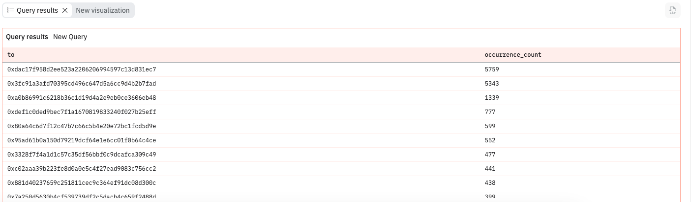

去ethscan搜一下前三名的地址：
排名第一的是一个合约地址：`0xdac17f958d2ee523a2206206994597c13d831ec7`

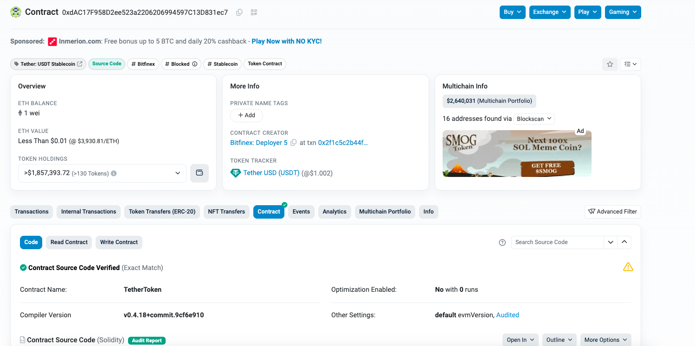

在合约创建者的地方我们可以看到，Bitfinex: Deployer 5。Bitfinex是一个交易所。

排名第二的地址也是个合约地址: `0x3fc91a3afd70395cd496c647d5a6cc9d4b2b7fad`,他是uniswaplabs发布的智能合约`UniversalRoute`

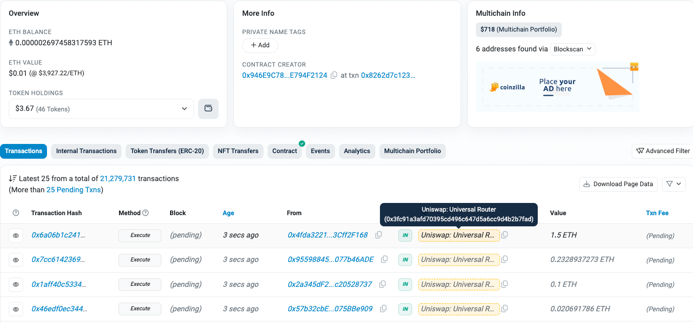

大概的作用是<https://learnblockchain.cn/article/5161>

第三的合约地址也是个合约地址:`0xa0b86991c6218b36c1d19d4a2e9eb0ce3606eb48`

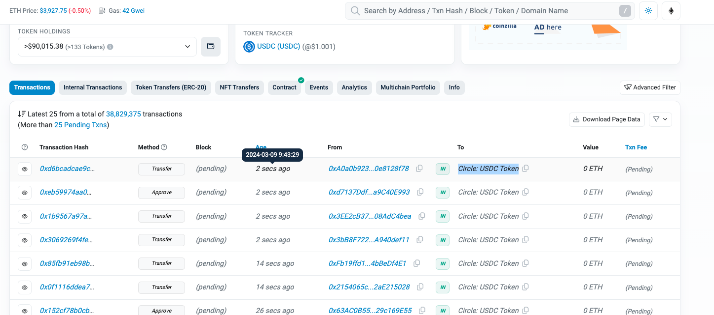

也许一个小时的交易量说明不了什么，另外这几个合约我也不太清楚具体的用途，所以我们放大时间戳看一下，查询一整天的记录，nb 还是这个三个地址


排名第五的地址：`0x95ad61b0a150d79219dcf64e1e6cc01f0b64c4ce` 是shibi的地址。

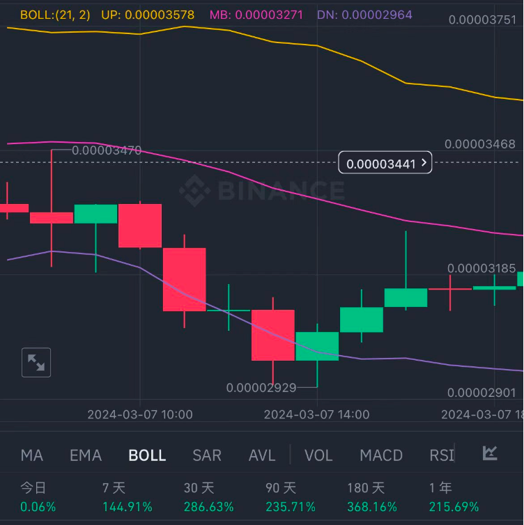

也许大家在抄底？当然，这个是我猜的。这块要分析具体的问题还得去查询这些合约交互发生了什么？还得继续学习，但是第一个查询就已经在此完成了！